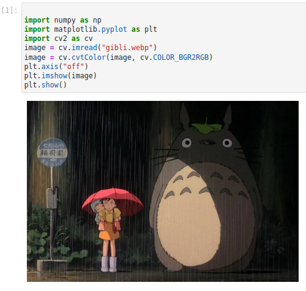
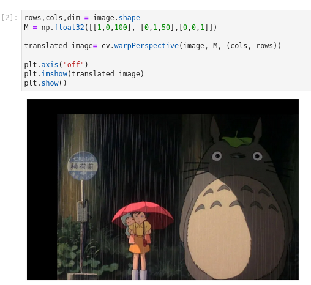
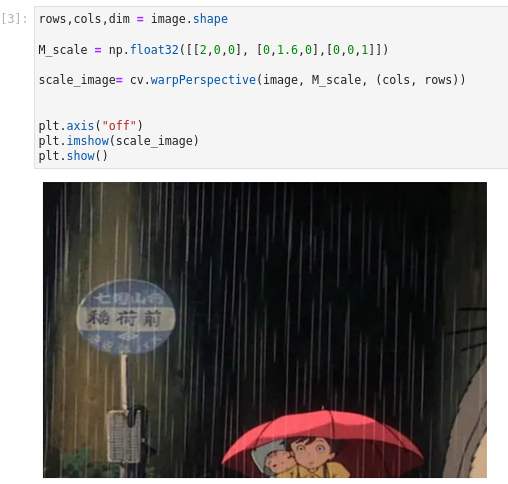
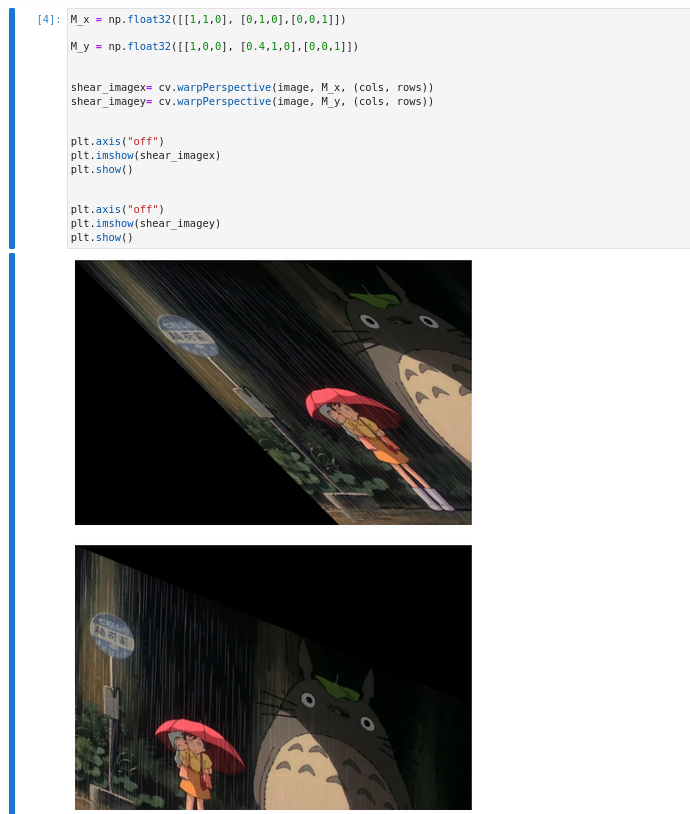
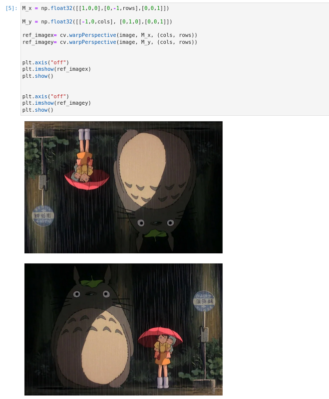
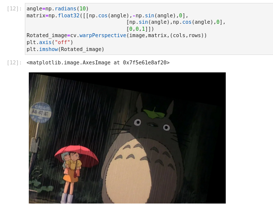
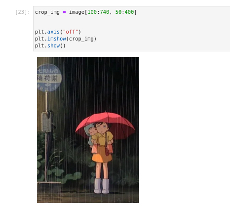

# Image-Transformation
## Aim 
To perform image transformation such as Translation, Scaling, Shearing, Reflection, Rotation and Cropping using OpenCV and Python.

## Software Required:
Anaconda - Python 3.7

# Algorithm:
## Step1:

Import the necessary libraries and read the original image and save it a image variable.

## Step2:

Translate the image using
Translation_matrix=np.float32([[1,0,120],[0,1,120],[0,0,1]]) Translated_image=cv2.warpPerspective(org_img,Translation_matrix,(col,row))

## Step3:

Scale the image using
Scaling_Matrix=np.float32([[1.2,0,0],[0,1.2,0],[0,0,1]])
Scaled_image=cv2.warpPerspective(org_img,Scaling_Matrix,(col,row))

## Step4:

Shear the image using
Shearing_matrix=np.float32([[1,0.2,0],[0.2,1,0],[0,0,1]])
Sheared_image=cv2.warpPerspective(org_img,Shearing_matrix,(col2,int(row1.5)))

## Step5:

Reflection of image can be achieved through the code
Reflection_matrix_row=np.float32([[1,0,0],[0,-1,row],[0,0,1]])
Reflected_image_row=cv2.warpPerspective(org_img,Reflection_matrix_row,(col,int(row)))

## Step6:

Rotate the image using Rotation_angle=np.radians(10)
Rotation_matrix=np.float32([[np.cos(Rotation_angle),-np.sin(Rotation_angle),0], [np.sin(Rotation_angle),np.cos(Rotation_angle),0], [0,0,1]])
Rotated_image=cv2.warpPerspective(org_img,Rotation_matrix,(col,(row)))

## Step7:
Crop the image using
cropped_image=org_img[10:350,320:560]

## Step8:
Display all the Transformed images. 

# Program:
```python
Developed By: Prasannalakshmi G
Register Number: 212222240075

import numpy as np
import matplotlib.pyplot as plt 
import cv2 as cv 
```
## i) Image Translation :
```python
#plotting of an image :
image = cv.imread("gibli.webp")
image = cv.cvtColor(image, cv.COLOR_BGR2RGB)

plt.axis("off")
plt.imshow(image)
plt.show()

#translation of an image :
rows,cols,dim = image.shape

M = np.float32([[1,0,100], [0,1,50],[0,0,1]])
translated_image= cv.warpPerspective(image, M, (cols, rows))

plt.axis("off")
plt.imshow(translated_image)
plt.show()
```
## ii) Image Scaling :
``` python
rows,cols,dim = image.shape

M_scale = np.float32([[2,0,0], [0,1.6,0],[0,0,1]])
scale_image= cv.warpPerspective(image, M_scale, (cols, rows))

plt.axis("off")
plt.imshow(scale_image)
plt.show()
```
## iii) Image shearing :
```python
M_x = np.float32([[1,1,0], [0,1,0],[0,0,1]])

M_y = np.float32([[1,0,0], [0.4,1,0],[0,0,1]])

shear_imagex= cv.warpPerspective(image, M_x, (cols, rows))
shear_imagey= cv.warpPerspective(image, M_y, (cols, rows))

plt.axis("off")
plt.imshow(shear_imagex)
plt.show()

plt.axis("off")
plt.imshow(shear_imagey)
plt.show()
```
## iv) Image Reflection :
```python
M_x = np.float32([[1,0,0],[0,-1,rows],[0,0,1]])

M_y = np.float32([[-1,0,cols], [0,1,0],[0,0,1]])

ref_imagex= cv.warpPerspective(image, M_x, (cols, rows))
ref_imagey= cv.warpPerspective(image, M_y, (cols, rows))

plt.axis("off")
plt.imshow(ref_imagex)
plt.show()

plt.axis("off")
plt.imshow(ref_imagey)
plt.show()
```
## v) Image Rotation :
```python
angle=np.radians(10)

matrix=np.float32([[np.cos(angle),-np.sin(angle),0],
                                [np.sin(angle),np.cos(angle),0],
                                [0,0,1]])

Rotated_image=cv.warpPerspective(image,matrix,(cols,rows))

plt.axis("off")
plt.imshow(Rotated_image)
```
## vi) Image Cropping :
```python
crop_img = image[100:740, 50:400]

plt.axis("off")
plt.imshow(crop_img)
plt.show()
```


# Output:

## i) Image Translation :
### Plotting of an image :



### Translation of an image :



## ii) Image Scaling :




## iii) Image shearing :



## iv) Image Reflection :



## v) Image Rotation :



## vi) Image Cropping :



# Result: 

Thus the different image transformations such as Translation, Scaling, Shearing, Reflection, Rotation and Cropping are done using OpenCV and python programming.
